<!-- NTS: end every sentence with a period -->
<div>
    <div>
        
    </div>
    <p>
        <h3><i>Welcome to the Travelling BusinessMan User Guide!</i></h3>
    </p>
    <p>
        <strong><i>Travelling BusinessMan</i></strong>, <strong><i>TBM</i></strong>, is a specialised contact management system targeted at business people with many international clients.
    </p>
    <p>
        <strong><i>TBM</i></strong> sorts and organises your clients for you, streamlines your workflow, improves business efficiency and so much more. All this is at the convenience of the Command-Line Interface. <strong><i>TBM</i></strong> does more than just tracking your clients!<br>
    </p>
    <p>
        This user guide will be a starting point for you in getting oriented with how <strong><i>TBM</i></strong> works and how you can integrate it into your professional journey!
    </p>
</div>

--------------------------------------------------------------------------------------------------------------------

## **Table of Contents**

* Table of Contents
{:toc}

--------------------------------------------------------------------------------------------------------------------

## **About**

### Using this User Guide
{:.no_toc}

This User Guide has been structured such that users can easily find and understand what they need.
* The [Table of Contents](#table-of-contents) has links that allow you to quickly navigate around this document.
* [Quickstart](#quickstart) consists of instructions to set up **_TBM_** and get yourself started. 
* [TBM Features](#tbms-features) include the details of the main features of **_TBM_**, such as managing your clients and keeping track of important information.
  * For each feature, we give a brief description of how you might use it, the command format as well as some useful examples.
  * We also provide a link that **leads to a specific part of [Appendix C: Expected Command Behaviour](#appendix-c-expected-command-behaviour-screenshots)** so you can see the before and after status of running these commands. There are **return links back to the command** for you to quickly return from the Appendix.  


### Tips
{:.no_toc}

<div markdown="block" class="alert alert-info">
**:information_source:** This is a tip for users.
</div> 

--------------------------------------------------------------------------------------------------------------------
## **Quickstart**

<div markdown="block" class="alert alert-info">

**:information_source:** Please refer to the [Introduction to UI](#appendix-a---introduction-to-the-ui) if you're trying **_TBM_** out for the first time.
</div>

Before you start using **_TBM_**, 

1. Ensure you have Java 11. 

1. Download the application file (.jar file) from [here](https://github.com/AY2021S1-CS2103T-F11-4/tp/releases).

1. Navigate to the directory that the application file was downloaded to. To start the application:

    1. Double click on the `TBM.jar` file and the application will start shortly.

    1. Alternatively, open any shell terminal in the current directory and run the command `java -jar TBM.jar`.
  
You should see the following display:


<p align="center"><i>Figure 1. TBM Application</i></p>

Now that you have started **_TBM_**,

1. Type any command in the command box and press Enter to execute it.

1. ***(Recommended for new users)*** The [`help`](#help-window) command will show a help page of some commonly
 used commands to fully utilise **_TBM_**.

   * **_Either_** press the **F1** key on your keyboard, **_or_** type the [`help`](#help-window) command in the command box and
    press Enter to execute it. e.g. typing [`help`](#help-window) and pressing Enter will open the help window.<br>

--------------------------------------------------------------------------------------------------------------------

## **TBM's Features**

**_TBM_**'s key features revolve around **_Managing your Clients_** and **_Keeping Track of Important Information_**. The following sections outline the commands that **_TBM_** supports. 
For each command, a short description of its intended use is followed by the _format_ that you should follow to execute the command correctly. Examples have been provided for the more complex commands. Should you need a **pictorial reference** on the before and after state of issuing these commands, links to the relevant sections within Appendix C have been provided for these commands.

A summary of all the commands can be found in our [command summary table](#command-summary).

Certain commands require parameters. A quick summary of these parameters as well as their prefixes and constraints can be found in our [parameters summary table](#parameter-constraints-summary).

<div markdown="block" class="alert alert-info">

**:information_source: Notes about the command format:**<br>

* Words in `UPPER_CASE` are the parameters to be supplied by the user.<br>
  e.g. in `client add n/NAME`, `NAME` is a parameter which can be used as `client add n/John Doe`.

* Items in square brackets are optional.<br>
  e.g `n/NAME [ce/CONTRACT_EXPIRY_DATE]` can be used as `n/John Doe ce/2-3-2020` (both supplied) or as `n/John Doe` (optional parameter missing).

* Items in round brackets mean that you have to supply at least one of them.<br>
  e.g. `CLIENT_INDEX (n/NAME) (n/PHONE_NUMBER)` can be used as `1 n/John Doe` or `1 p/98899889` or `1 n/John Doe p/98899889`, but not as `1` (i.e. both items are not supplied).

* Items with `…`​ after them can be used multiple times including zero times.<br>
  e.g. `[t/TAG]…​` can be used as ` ` (i.e. 0 times), `t/friend`, `t/friend t/family` etc.

* Parameters can be supplied in any order.<br>
  e.g. if the command specifies `n/NAME p/PHONE_NUMBER`, `p/PHONE_NUMBER n/NAME` is also acceptable.

*  **Parameter prefixes such as `t/` and `nt/` are *special keywords* and you should not use them for any other purposes except for indicating the start of a parameter.**

</div>

--------------------------------------------------------------------------------------------------------------------

### **1. Managing your Clients** 

To do your **_business in bliss_** , you need to keep track of a multitude of clients and, you need to do it quickly. **Adding**, **Deleting**, **Editing**, **Viewing** and **Finding** your clients can be done in a mere _handful of keystrokes_ that make the most out of your fast typing speeds.

#### 1.1: Adding a client: `client add`

Adds a new client into **_TBM_**, you simply have to provide the mandatory parameters as described by the format below. Adding the other optional parameters can be done by subsequently issuing an `edit` command for that client. 

Format: `client add n/NAME p/PHONE_NUMBER e/EMAIL a/ADDRESS c/COUNTRY_CODE tz/TIMEZONE [ce/CONTRACT_EXPIRY_DATE]`

Please refer to [Appendix B](#appendix-b-international-standards-followed) to understand the International Standards that **_TBM_** follows for phone numbers and country codes.<br><br>
Example:

* Command: `client add n/Katya p/98123456 e/katya@yahoo.com a/Vladivostok, Nevelskogo, bld. 15, appt. 256 c/RU tz/UTC+03:00 ce/2-3-2020`<br>

  Adds a new client with name **Katya**, phone number **98123456**, email **katya@yahoo.com**, address **Vladivostok, Nevelskogo, bld. 15, appt. 256**, country **Russia**, timezone **UTC+03:00**, contract expiry date **2 Mar 2020**.

For a visual example on how the command works, refer to [Appendix C: Expected Command Behaviour Screenshots](#adding-a-client)

[Back to Table of Contents](#table-of-contents)

#### 1.2: Deleting a client: `client delete`

Deletes an existing client from **_TBM_**, you have to make reference to the Client's index. This can be easily read off from the client card as shown [here](#ui-when-viewing-clients).

Format: `client delete CLIENT_INDEX`

Example:

* Command: `client delete 5`

    Deletes the client at index 5 of the list panel.

For a visual example on how the command works, refer to [Appendix C: Expected Command Behaviour Screenshots](#deleting-a-client)

[Back to Table of Contents](#table-of-contents)

#### 1.3: Editing a client: `client edit`

Edits a client's information by their index in the list view. Only edits the fields that have been passed in as parameters.

Format: `client edit CLIENT_INDEX (n/NAME) (p/PHONE) (e/EMAIL) (a/ADDRESS) (c/COUNTRY_CODE) (tz/TIMEZONE) (ce/CONTRACT_EXPIRY)`

Examples:

* Command: `client edit 5 n/Katya`

    Only edits **name** to `Katya`, other fields remain the same.

* Command: `client edit 4 n/Alek p/34842097 e/dcsdcr@nus.edu.sg`

    Edits **name** to `Alek`, **phone number** to `34842097` and **email** to `dcsdcr@nus.edu.sg`, other fields remain the same.

* Command: `client edit 1 c/JP tz/UTC+07:00`

    Edits **country** to `Japan` and **timezone** to `UTC+07:00`, other fields remain the same.

For a visual example on how the command works, refer to [Appendix C: Expected Command Behaviour Screenshots](#editing-a-client)

[Back to Table of Contents](#table-of-contents)

#### 1.4: Viewing _all_ your Clients: `client list`

Shows a list of all clients in **_TBM_**. Client Cards are intended to display the most important details succinctly. Therefore, if a particular data field is too long, you should view them in full using the [`client view`](#15-viewing-a-particular-client-client-view) command.

This command will also reset the left display panel to its default view. 

Format: `client list`

For a visual example on how the command works, refer to [Appendix C: Expected Command Behaviour Screenshots](#viewing-all-clients)

[Back to Table of Contents](#table-of-contents)

#### 1.5: Viewing _a Particular_ Client: `client view`

Views the client specified by the `CLIENT_INDEX` parameter. All the details for this client as well as notes related to this client will be shown in the Display Panel.
<div markdown="block" class="alert alert-info">

**:information_source:** Please refer to [this](#ui-when-viewing-clients) if you need to be re-acquainted with the UI for client related commands
</div>

Format: `client view CLIENT_INDEX`

Example:

Given the current list of clients:
```
1. Katya
2. Alex
```
Command: `client view 2`

The information for the client at index 2 of the list will be shown. In the example above, Alex's information will be displayed.

For a visual example on how the command works, refer to [Appendix C: Expected Command Behaviour Screenshots](#viewing-a-client)

[Back to Table of Contents](#table-of-contents)

#### 1.6: Finding clients: `client find`

Finds clients whose names contain any of the given keywords.

Format: `client find KEYWORD [MORE_KEYWORDS]`

* The search is case-insensitive. e.g `hans` will match `Hans`.
* The order of the keywords does not matter. e.g. `Hans Bo` will match `Bo Hans`.
* Only the name is searched.
* Only full words will be matched e.g. `Han` will not match `Hans`.
* Clients matching at least one keyword will be returned (i.e. OR search). e.g. `Hans Bo` will return `Hans Gruber` and `Bo Yang`.

Examples:

* Command: `client find katya`

   Finds all clients with names that matches **katya**.

* Command: `client find Katya Hans`

   Finds all clients whose names contain either **Katya** or **Hans**.

For a visual example on how the command works, refer to [Appendix C: Expected Command Behaviour Screenshots](#finding-clients)

[Back to Table of Contents](#table-of-contents)

#### 1.7: Filtering clients by country: `country filter`

Filters and gives you a list of clients that are associated to the specificed country.

Format: `country filter c/COUNTRY_CODE`

Examples:

* Command: `country filter c/SG`

    Filters by clients in Singapore.

* Command: `country filter c/RU`

    Filters by clients in Russia.

For a visual example on how the command works, refer to [Appendix C: Expected Command Behaviour Screenshots](#filtering-by-country).

[Back to Table of Contents](#table-of-contents)

--------------------------------------------------------------------------------------------------------------------

### **2. Keeping Track of Important Information via Notes and Tags**

Managing your relationships with your Clients is quick and easy thanks to **_TBM_**'s Notes and Tags. You can write notes about your Clients or Countries to help you remember the nuances that you need to be mindful of. You can tag these notes for easy reference as well. 


<div markdown="block" class="alert alert-info">
**:information_source:** We treat "untagged" as a special tag. In the case that your note doesn't have a tag when you're creating it, we'll auto-add this special tag for you so that you don't have to. Subsequently you may choose to attach a proper tag to it when you've thought of one. Therefore, there is no need for you to tag any note as "untagged". In the case that you forget our auto-adding feature, we'll still let your command work but this special tag will not be added if your note already has other tags.
</div>

#### 2.1: Client Notes

##### 2.1.1: Adding client notes: `client note add`

Adds a note to a particular client at the specified index in the list view. **_TBM_** will notify you with a **"duplicate note"** message if you happen to add a note which already exists (i.e. has the same content and set of tags). We do this to avoid unnecessary clutter for you.

<div markdown="block" class="alert alert-info">
**:information_source:** Even if the client is not currently being displayed in the left display panel, client notes for that client can still be added, as long as that client is present in the client list view.
</div>

Format: `client note add CLIENT_INDEX nt/NOTE_STRING [t/TAG]...`

Examples:

* Command: `client note add 1 nt/wants meetings to be as short as possible (preferably 30 mins) t/pref`

    Adds a **note** with a **tag** to the **first** client in the list.

* Command: `client note add 2 nt/prefers emails to calls`

    Adds a **note** to the **second** client in the list.

* Command: `client note add 4 nt/need to slowly convince him to sign the contract t/meeting `

    Adds a **note** with a **tag** to the **fourth** client in the list.

For a visual example on how the command works, refer to [Appendix C: Expected Command Behaviour Screenshots](#adding-client-notes)

[Back to Table of Contents](#table-of-contents)

##### 2.1.2: Deleting client notes: `client note delete`

Deletes a note of a client (denoted by a client's index) by the note's index.

Format: `client note delete CLIENT_INDEX CLIENT_NOTE_INDEX`

Examples: 
* `client note delete 2 1`
* `client note delete 1 12` i.e. 12th note of client 1

For a visual example on how the command works, refer to [Appendix C: Expected Command Behaviour Screenshots](#deleting-client-notes)

[Back to Table of Contents](#table-of-contents)

##### 2.1.3: Editing client notes: `client note edit`

Edits a note of a client (denoted by that client's index) by the note's index. Supplying tags to the command will add the tags onto the current existing tags for that note.

Format: `client note edit CLIENT_INDEX CLIENT_NOTE_INDEX (nt/NOTE_STRING) (t/TAG)...`

Examples:

* `client note edit 2 1 nt/prefers face-to-face meetings to calls`
  Just edits the note contents. The existing tags will be preserved.

* `client note edit 2 1 t/ItalianRestaurants`
  Just adds a new tag `t/ItalianRestaurants`. Existing tags and the note contents will be unchanged.


* `client note edit 2 1 nt/prefers face-to-face meetings to calls t/ItalianRestaurants`
  Edits the note contents as well as adds a new tag `t/ItalianRestaurants`

For a visual example on how the command works, refer to [Appendix C: Expected Command Behaviour Screenshots](#editing-client-notes)

[Back to Table of Contents](#table-of-contents)

#### 2.2: Country Notes


##### 2.2.1: Viewing notes for a country: `country note view`

<div markdown="block" class="alert alert-info">

**:information_source:** Please refer to [this](#ui-when-viewing-country) if you need to be re-acquainted with the UI for country note related commands
</div>

Views the list of country notes that are associated with the country corresponding to the country code supplied.
If no country code is given, all country notes in **_TBM_** will be shown.

Format: `country note view [c/COUNTRY_CODE]`

Examples:

* Command: `country note view`

    All country notes in **_TBM_** will be displayed.

* Command: `country note view c/SG`

    Only country notes for **Singapore** will be displayed.

For a visual example on how the command works, refer to [Appendix C: Expected Command Behaviour Screenshots](#viewing-country-note).

[Back to Table of Contents](#table-of-contents)

##### 2.2.2: Adding notes for a country: `country note add`

Adds a note that will be associated with the country corresponding to the country code supplied.

Format: `country note add c/COUNTRY_CODE nt/NOTE_STRING [t/TAG]...`

Examples:

* Command: `country note add c/SG nt/has one of the lowest corporate taxes in the world t/tax`

    Adds a **note** for the country of **Singapore** with the following specifications: 
    - Content: **_has one of the lowest corporate taxes in the world_** 
    - Tag: **_tax_**
    <br><br>
    
* Command: `country note add c/CN nt/building good relations (guanxi) is important when conducting business here t/intercultural`

    Adds a **note** for the country of **China** with the following specifications: 
    - Content: **_building good relations (guanxi) is important when conducting business here_** 
    - Tag: **_intercultural_** 
    <br><br>
    
* Command: `country note add c/IN nt/is world's fastest growing economy`

    Adds a **note** for the country of **India** with the following specifications:
    - Content: **_is world's fastest growing economy_** 
    - Tag: **_untagged_**

For a visual example on how the command works, refer to [Appendix C: Expected Command Behaviour Screenshots](#adding-country-note).
  
[Back to Table of Contents](#table-of-contents)
  
##### 2.2.3: Editing notes for a country: `country note edit`

Edits a note that is associated with a specific country at the given index based on the **current view** of the [list panel displaying country notes](#ui-when-viewing-country). Supplying tags to the command will add the tags onto the current existing tags for that note.

Due to ambiguity, editing of a country note when the country notes panel is not being displayed is not allowed, and an error message will be shown if this is attempted.

Format: `country note edit COUNTRY_NOTE_INDEX (nt/NOTE_STRING) (t/TAG)...`

Example:

Given the list of country notes in the country note list panel:

```
Japan
--------
1. A high-context country, hence building relationships is important for doing business [tag: intercultural]

Singapore
--------
2. Small domestic market as compared to rest of SEA countries [tag: marketsize]

Thailand
--------
3. Political unrest in the capital [tag: politics]
```

Command: `country note edit 2 nt/Rising middle class with increased purchasing power t/spending`

Edits the second country note in the country notes panel. In this case, it will be the note under **Singapore**. The resulting list will look like:

```
Japan
--------
1. A high-context country, hence building relationships is important for doing business [tag: intercultural]

Singapore
--------
2. Rising middle class with increased purchasing power [tag: marketsize, spending]

Thailand
--------
3. Political unrest in the capital [tag: politics]
```

For a visual example on how the command works, refer to [Appendix C: Expected Command Behaviour Screenshots](#editing-country-note).

[Back to Table of Contents](#table-of-contents)

##### 2.2.4: Deleting notes for a country: `country note delete`

Deletes a note that is associated with a specific country at the given index based on the **current view** of the [list panel displaying country notes](#ui-when-viewing-country).

Due to ambiguity, deleting of a country note when the country notes panel is not being displayed is not allowed, and an error message will be shown if this is attempted.

Format: `country note delete COUNTRY_NOTE_INDEX`

Example:

* Command: `country note delete 1`

    Deletes the country note at index 1 of the country notes list panel.
    
For a visual example on how the command works, refer to [Appendix C: Expected Command Behaviour Screenshots](#deleting-country-note).

[Back to Table of Contents](#table-of-contents)

### **3. Getting Suggested Clients**


Obtains a list of clients based on the client suggestion type(s) passed in. This command will also reset the left display panel to its default view.

Format: `client suggest by/SUGGESTION_TYPE [by/SUGGESTION_TYPE]...`

Examples:

* Command: `client suggest by/available`

    Obtains a list of clients where the time is 1800-2200 in the client's timezone (off work hours).

* Command: `client suggest by/frequency`

    Obtains a list of clients based on the last time their details were modified in **_TBM_**. Clients will be considered modified on adding a client, editing a client, adding a client note, deleting a client note or editing a client note. Clients who have not been modified for a longer period will be the first in the list.

* `client suggest by/contract`

    Obtains a list of clients based on their current contract details. Clients whose contracts are expiring will be shown first.

* `client suggest by/contract by/available`

    Obtains a list of clients based on their current contract details but only clients who are available will be shown. Clients whose contracts are expiring will be shown first.

For a visual example on how the command works, refer to [Appendix C: Expected Command Behaviour Screenshots](#getting-client-suggestions).

[Back to Table of Contents](#table-of-contents)

### **4. Clearing All your Entries**

Deletes all existing information from the application. The end result will be an application with no client/note/country data. The left display panel will be reset to its default view.

Format: `clear`

For a visual example on how the command works, refer to [Appendix C: Expected Command Behaviour Screenshots](#clearing-all-data).

[Back to Table of Contents](#table-of-contents)

### **5. Exiting the Program**

Exits the program.

Format: `exit`

[Back to Table of Contents](#table-of-contents)

### **6. Saving your Data**

Your data is automatically saved after every command you enter. The file is saved in the ubiquitous `.json` format, which
allows you to edit the file manually without even opening **_TBM_** up.

The location for this file is `./data/tbmManager.json` (indicated at the bottom left of the application), where the
 `.` represents the directory where you have saved `TBM.jar`. Here's a snippet of this editable text file:

```json5
{
  "clients" : [ {
    "name" : "Alex Yeoh",
    "phone" : "87438807",
    "email" : "alexyeoh@example.com",
    "address" : "Blk 30 Geylang Street 29, #06-40",
    "country" : "SG",
    "timezone" : "UTC+08:00",
    "contractExpiryDate" : "21-4-2022",
    "lastModifiedInstant" : "2020-11-09T10:07:41.177807Z",
    "clientNotes" : [ {
      "contents" : "Wants to take his wife to Norway for New Years' Day",
      "countryCode" : "NULL_CC",
      "tags" : [ "romantic", "holidayPlans" ]
    }, {
      "contents" : "Prefers to meet up at his office, not that much of a public spaces guy",
      "countryCode" : "NULL_CC",
      "tags" : [ "workPreferences", "meetings" ]
    }, {
      "contents" : "Need to meet him to see his vintage Honda with a side-car.He really loves old cars",
      "countryCode" : "NULL_CC",
      "tags" : [ "hobbies" ]
    }, {
      "contents" : "Birthday tomorrow",
      "countryCode" : "NULL_CC",
      "tags" : [ "reminder" ]
    } ]
  . . .
}
```

<div markdown="block" class="alert alert-info">
**:information_source:** Tweaking this file should be done <strong><i>only</i></strong> if you're familiar with JSON. If you're new to JSON, <a href="https://www.json.org/json-en.html">here's</a> a good place to learn more.<br>
If the `tbmManager.json` file gets corrupted, for example, if some fields were changed to contain invalid values, **_TBM_** will be unable to load your data. The only exception is the `lastModifiedInstant` field, which will be regenerated by **_TBM_**.
</div>

[Back to Table of Contents](#table-of-contents)


### **7. Viewing Help**

**_TBM_**'s commands are easy to use and remember, but in the case you need to see a list of commonly used commands, simply type `help` or press the `F1` key to access this list in the [new help window](#help-window). Pressing the `Esc` key will close this window.

Format: `help`

[Back to Table of Contents](#table-of-contents)

--------------------------------------------------------------------------------------------------------------------

## **Glossary**

* **Business Contact**: Synonymous with **Client**
* **Client**: Refers to a person whom the user is conducting his/her business with
* **UTC**: [Coordinated Universal Time](https://en.wikipedia.org/wiki/Coordinated_Universal_Time)
* **Mainstream OS**: Windows, Linux, Unix, macOS
* **_TBM_**: Initialism for Travelling BusinessMan

## **Frequently Asked Questions (FAQ)**

**Q1**: How do I transfer my data to another computer?<br>
**A**: Install the app in the other computer and overwrite the empty data file it creates with the file that contains the data of your previous **_TBM_** home folder.<br>

**Q2**: How do I know if Java 11 is already installed on my computer?<br>
**A**: Open up your favourite command line application and run the command `java --version`. The output should contain `java 11` if Java 11 is installed.<br>

**Q3**: How do I install Java 11 on my computer?<br>
**A**: Head to the official download page [here](https://www.oracle.com/java/technologies/javase/jdk11-archive-downloads.html), then download and run the installer for your operating system.<br>

[Back to Table of Contents](#table-of-contents)

--------------------------------------------------------------------------------------------------------------------

## **Command Summary**

Action | Format, Examples
--------|------------------
**List all clients** | `client list`
**Add client** | `client add n/NAME p/PHONE_NUMBER e/EMAIL a/ADDRESS c/COUNTRY_CODE tz/TIMEZONE [ce/CONTRACT_EXPIRY_DATE]` <br> e.g., `client add n/Katya p/98123456 e/katya@yahoo.com a/Vladivostok, Nevelskogo, bld. 15, appt. 256 c/RU tz/UTC+03:00 ce/22-12-2020`
**Edit client** | `client edit CLIENT_INDEX (n/NAME) (p/PHONE) (e/EMAIL) (a/ADDRESS) (c/COUNTRY_CODE) (tz/TIMEZONE) (ce/CONTRACT_EXPIRY_DATE)`<br> e.g.,`client edit 3 c/JP tz/UTC+07:00`
**View client** | `client view CLIENT_INDEX` <br> e.g., `client view 2`
**Find client** | `client find KEYWORD [MORE_KEYWORDS]`<br> e.g., `client find Hans`
**Client suggestions** | `client suggest by/SUGGESTION_TYPE [by/SUGGESTION_TYPE]...` <br> e.g., `client suggest by/available by/frequency`
**Delete client** | `client delete CLIENT_INDEX`<br> e.g., `client delete 3`
**Add client note** | `client note add CLIENT_INDEX nt/NOTE_STRING [t/TAG]...` <br> e.g., `client note add 4 t/meeting nt/need to slowly convince him to sign the contract`
**Delete client note** | `client note delete CLIENT_INDEX CLIENT_NOTE_INDEX` <br> e.g., `client note delete 3 2`
**Edit client note** | `client note edit CLIENT_INDEX CLIENT_NOTE_INDEX (nt/NOTE_STRING) (t/TAG)...` <br> e.g., `client note edit 3 2 nt/Loves cats t/pets`
**Filter by country** | `country filter c/COUNTRY_CODE` <br> e.g., `country filter c/SG`
**View country note** | `country note view [c/COUNTRY_CODE]` <br> e.g., `country note view c/SG`
**Add country note** | `country note add c/COUNTRY_CODE nt/NOTE_STRING [t/TAG]...` <br> e.g., `country note add c/SG nt/has one of the lowest coporate taxes in the world t/tax`
**Edit country note** | `country note edit COUNTRY_NOTE_INDEX (nt/NOTE_STRING) (t/TAG)...` <br> e.g., `country note edit 1 nt/has one of the lowest coporate taxes in the world t/tax`
**Delete country note** | `country note delete COUNTRY_NOTE_INDEX` <br> e.g., `country note delete 1`
**Clear** | `clear`
**Exit** | `exit`
**Help** | `help`

[Back to Table of Contents](#table-of-contents)

--------------------------------------------------------------------------------------------------------------------

## **Parameter Constraints Summary**


| Parameter | Prefix | Constraints, Examples|
|--------|------------------| ----------|
|**NAME** | `n/` | Names should only contain alphanumeric characters and spaces, and it should not be blank. <br> e.g. `n/John Doe` |
|**PHONE_NUMBER** | `p/` | Phone numbers should have at least 3 digits and at most 15 digits. <br> Please refer to [Appendix B](#appendix-b-international-standards-followed) for a comprehensive description. <br> e.g. `p/81867752` or `p/+65 81867752` |
|**EMAIL** | `e/` | Emails should be of the format local-part@domain. <br> e.g. `e/katya@yahoo.com` |
|**ADDRESS** |`a/` | Addresses can take any values, and it should not be blank. <br> e.g. `Vladivostok, Nevelskogo, bld. 15, appt. 256` |
|**COUNTRY_CODE** | `c/` | A 2-letter country code that follows the ISO3166 specification <br> This [finding tool](https://www.countrycode.org/) can be used. <br> e.g. `c/SG` (Singapore) |
|**TIMEZONE** | `tz/` | Timezone should be given in offsets relative to [Coordinated Universal Time](https://en.wikipedia.org/wiki/Coordinated_Universal_Time) in the format `UTC+HH:MM` where `HH` refers to the offset in hours and `MM` refers to the offset in minutes. The full list of valid timezones can be found [here](https://www.timeanddate.com/time/current-number-time-zones.html) <br> e.g. `tz/UTC+08:00` |
|**CONTRACT_EXPIRY_DATE** | `ce/` | Date should be given in the format "DD-MM-YYYY". <br> e.g. `ce/10-10-2020` |
|**NOTE_STRING** | `nt/` | Notes can take any values, and it should not be blank. <br> e.g. `nt/Likes cats` |
|**TAG** | `t/` | Tags names should be alphanumeric and have a maximum of 45 characters. <br> e.g. `t/important` |
|**SUGGESTION_TYPE** | `by/` | Suggestion types can only be either `available`, `contract` or `frequency`. <br> e.g. `by/available` |
|**CLIENT_INDEX / CLIENT_NOTE_INDEX / COUNTRY_NOTE_INDEX** | - | Index is a number greater than 0 that is based on the numberings beside each client or note. <br> e.g. `1` would refer to the first client or note. |

[Back to Table of Contents](#table-of-contents)


---------------------------------------------------------------------------------------------------------------------


## **Glossary**

* **Business Contact**: Synonymous with **Client**
* **Client**: Refers to a person whom the user is conducting his/her business with
* **UTC**: [Coordinated Universal Time](https://en.wikipedia.org/wiki/Coordinated_Universal_Time)
* **Mainstream OS**: Windows, Linux, Unix, macOS
* **_TBM_**: Initialism for Travelling BusinessMan

[Back to Table of Contents](#table-of-contents)


---------------------------------------------------------------------------------------------------------------------


## **Frequently Asked Questions (FAQ)**

**Q1**: How do I transfer my data to another computer?<br>
**A**: Install the app in the other computer and overwrite the empty data file it creates with the file that contains the data of your previous **_TBM_** home folder.<br>

**Q2**: How do I know if Java 11 is already installed on my computer?<br>
**A**: Open up your favourite command line application and run the command `java --version`. The output should contain `java 11` if Java 11 is installed.<br>

**Q3**: How do I install Java 11 on my computer?<br>
**A**: Head to the official download page [here](https://www.oracle.com/java/technologies/javase/jdk11-archive-downloads.html), then download and run the installer for your operating system.<br>

[Back to Table of Contents](#table-of-contents)

--------------------------------------------------------------------------------------------------------------------

## **Appendix A - Introduction to the UI**

### **Start Page**

The diagram below shows the key UI elements of **_TBM_** upon first start-up.

  
  <p align="center"><i>Figure 2. Default View</i></p>

* **Command Box** allows you to input commands to interact with **_TBM_**.

* **Client List Panel** will always allow you to view all your clients' information at a go. It's scrollable so that you 
never have to worry about not being able to see all your important clients at a single glance!

* **Client Card** will show you brief information about a particular client. 

* **Result Display** will show you the output of executing your command.
    * It indicates successful commands.
    
    * On the off-chance there's a syntax issue, **_TBM_** will remind you of the correct syntax it expects, something like this:
 
     
     <p align="center"><i>Figure 3. Error Display</i></p>
     
* **Display Panel** shall render *Client Cards* or *Country Cards* when relevant commands are sent. The default view shows you your local time to the precise second, as well as your current location.
* **Local Time** indicates the local date and time based on where you are currently. 
   
### **UI when Viewing Clients**

The diagram below is what you should see upon viewing a particular client (i.e. firing up the command `client view 1`). It shows how to identify a particular client's `CLIENT_INDEX`, and an associated note's `CLIENT_NOTE_INDEX`.

  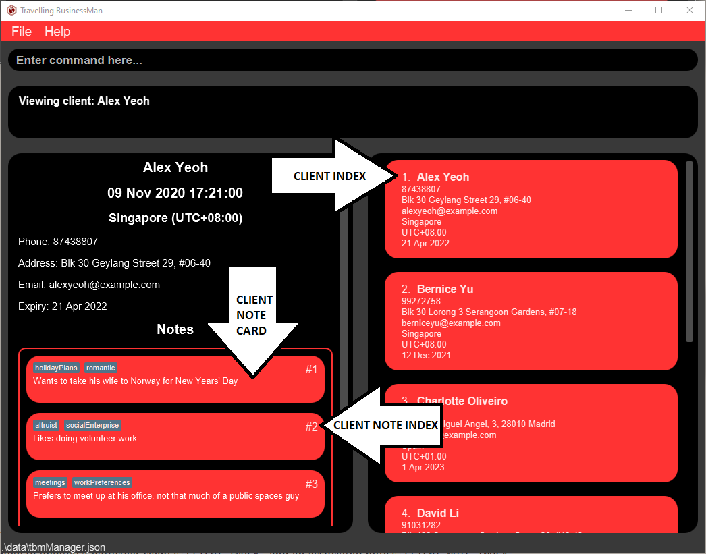
  <p align="center"><i>Figure 4. Client View</i></p>

Here, the **Client Note Card** displaying the note that's tagged as `hobbies` is referred to by the `CLIENT_INDEX` of `1`.

Being able to identify these is key to adding, deleting and editing client notes as well as editing clients. The time displayed here is the Client's local time!

### **UI when Viewing Country**

Similarly, `COUNTRY_NOTE_INDEX` can be identified like so by referring to the index indicated on the **Country Note Card**:

  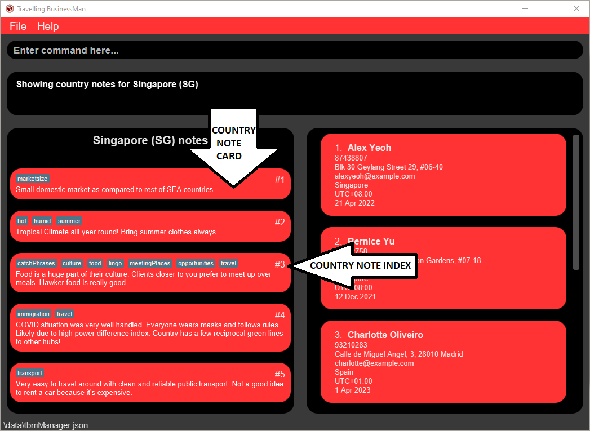
  <p align="center"><i>Figure 5. Country Note View</i></p>

### **Help Window**

This is what to expect when you type in the `help` command or press `F1`: 

  
  <p align="center"><i>Figure 6. Help Window</i></p>

<p align="center">
   <strong><i>{End of Appendix A, please return to the <a href="#table-of-contents">Table of Contents</a>}</i></strong> 
</p>


--------------------------------------------------------------------------------------------------------------------


## **Appendix B: International Standards Followed** 

### **ISO Country Codes**

**_TBM_** utilizes 2-letter country codes that follow the **_ISO3166_** specification. This [finding tool](https://www.countrycode.org/) can be used.

### **Phone Numbers**

**_TBM_**'s format for phone numbers is **_based_** on the [E.164 standard](https://en.wikipedia.org/wiki/E.164) as recommended by the _ITU Telecommunication Standardization Sector (ITU-T)_.
**_However_**, **_TBM_** doesn't allow for spaces in between phone number fields. For example, `+65 8186 7742` may follow this international standard, but **_TBM_ requires you to remove spacing within the phone number field** so the correct way to input it would be `+65 81867742`. 

Here are the alternative stylistic choices that you might make when writing out phone numbers, all of which are valid:
* Phone numbers can be grouped into `COUNTRY_CODE` and `NATIONAL_PHONE_NUMBER`. We shall refer to `NATIONAL_PHONE_NUMBER` simply as **_phone number field_** in this appendix.
    * Please note that the **_phone number field_** may only have a **maximum of 12 digits**, all without spaces. The digit count restriction is as per the "global services specification" of **E.164**.
    * `COUNTRY_CODE` field is optional and may be omitted by you. 
      * Adding country codes for the telephone numbers:
        * Country code numbers range from 1 to 3 digits and may be found from this [finding tool](https://www.countrycode.org/). You **must** prepend the country code with a `+` character.  
          * `+6581867742` is a valid phone number where `+65` is the country code for Singapore.
        * **If you wish to, you may also separate country code and phone number fields with a delimiter:** Valid delimiters include: the " " character, "-", and "."
          * `+65 81867742` with a " " character is also a valid phone number. 
          * `+65-81867742` with a "-" character is also a valid phone number.
          * `+65.81867742` with a "." character is also a valid phone number.
            
         These options have been provided because we know that such delimiting is a matter of _cultural preference_.

<p align="center">
   <strong><i>{End of Appendix B, please return to the <a href="#table-of-contents">Table of Contents</a>}</i></strong> 
</p>


--------------------------------------------------------------------------------------------------------------------


## **Appendix C: Expected Command Behaviour Screenshots**

We've added screenshots for you to refer to, to determine easily what the output should be upon issuing a particular command.  

### Adding a client

In the initial state of TBM below, we can see that there are currently no clients in our application.

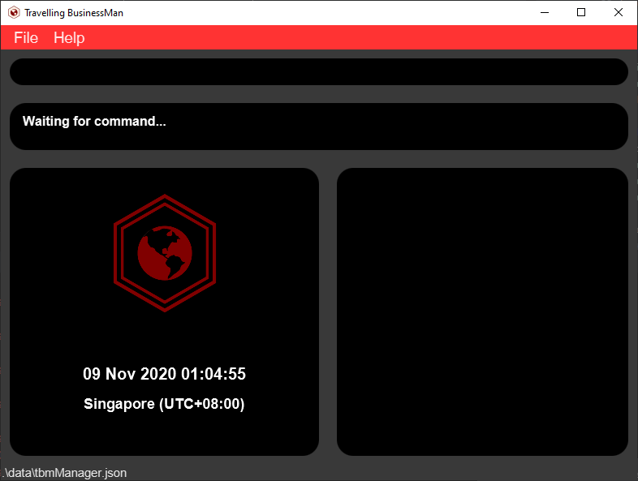

To add a client, we execute the following command:

Command: `client add n/Katya p/98123456 e/katya@yahoo.com a/Vladivostok, Nevelskogo, bld. 15, appt. 256 c/RU tz/UTC+03:00 ce/2-3-2020`

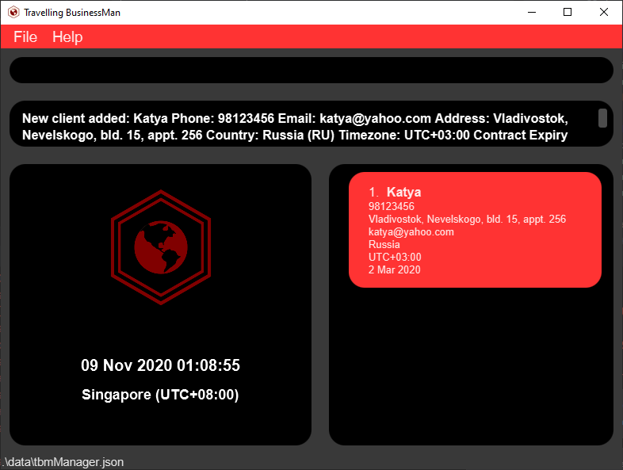

The client should appear with **name** Katya, **phone number** 98123456, **email address** katya@yahoo.com, **address** Vladivostok, Nevelskogo, bld. 15, appt. 256, **country** Russia, **timezone offset** of UTC+03:00 and a **contract expiry date** of 2 March 2020.

[Back to command](#11-adding-a-client-client-add)

### Deleting a client

In the initial state of TBM below, we have one client **Katya** in our application.

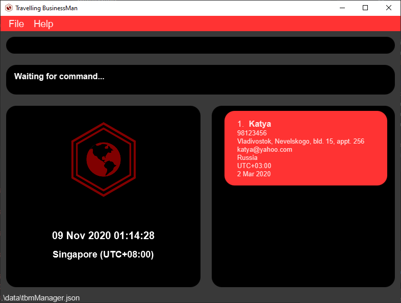

We see that the number beside **Katya** indicates that she has a `CLIENT_INDEX` of `1`. If we wish to delete the client **Katya**, we execute the following command: 

Command: `client delete 1`

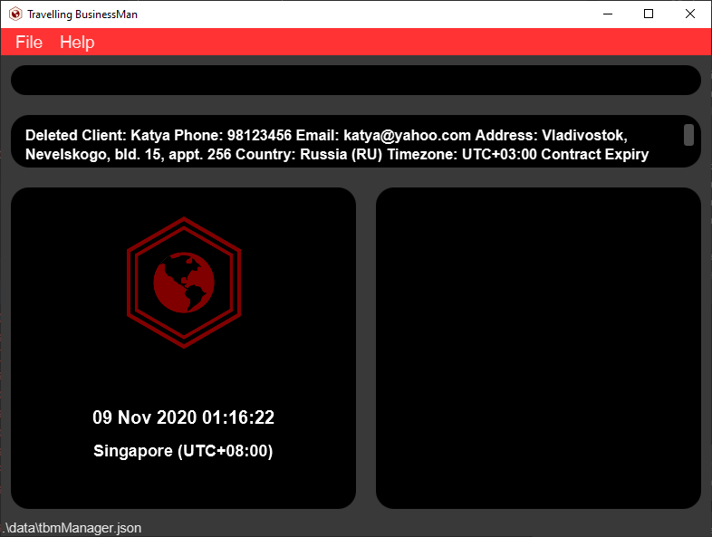

The client should now be removed from our application, and we now have an empty client list panel.

[Back to command](#12-deleting-a-client-client-delete)

### Editing a client

In the initial state of TBM below, we have multiple clients in our client list panel. 


Suppose the client named **Alex Yeoh** has changed his number to `12345678`, we obtain his `CLIENT_INDEX` from the number beside his name (1) in the list panel and we execute the following command: 

Command: `client edit 1 p/12345678`

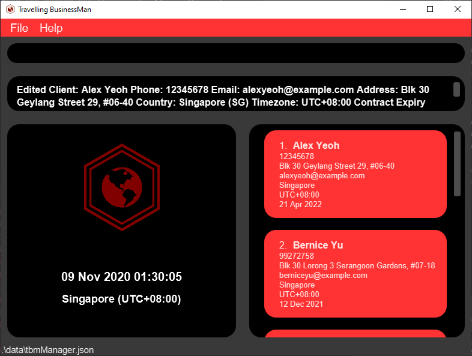

As we can see, the client's number has changed from `87438807` to `12345678`.

[Back to command](#13-editing-a-client-client-edit)

### Viewing all clients

Let's say that you have filtered and viewed a client, and your TBM looks something like this:


If you want to reset the filtering and list all clients, you can execute the `client list` command, which will cause TBM to go back to its default view, like so:


[Back to command](#14-viewing-all-your-clients-client-list)

### Viewing a client

In the initial state of TBM below, we have multiple clients in our client list panel. Currently, the display panel on the left is showing the default home screen.


If we want to know more information about the client named **Bernice Yu**, we obtain his `CLIENT_INDEX` from the number beside his name (2) in the list panel and we execute the following command: 

Command: `client view 2`  

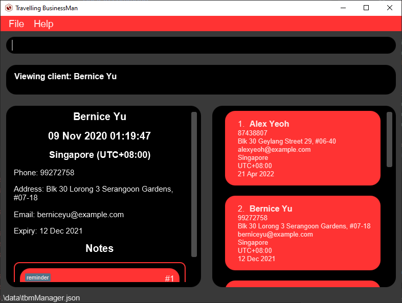

The client's information will appear in the display panel on the left where we can view more information regarding the client such as the time in his timezone as well as our notes for that client.

[Back to command](#15-viewing-a-particular-client-client-view)

### Finding clients

Before executing the find command, here is what the initial state of TBM looks like:


After executing the find command, we see that the client list has been filtered to only those clients with names that contain the supplied keyword:


[Back to command](#16-finding-clients-client-find)

### Filtering by country

Before filtering, here is what it looks like,

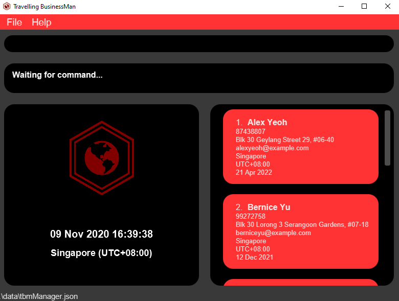

After filtering for clients from Spain,

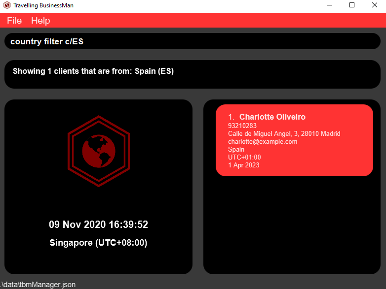

[Back to command](#17-filtering-clients-by-country-country-filter).

### Adding client notes

Adding client notes can be done at any time regardless of which window you're seeing at that moment. In the following, we add a client note from the default start page itself. 


We wish to add the following tagged note: 

`client note add 2 nt/prefers emails to calls t/preference t/busyBee`

Upon issuing the command, you'll be notified of the addition, but it won't disturb the current view you're in and will do so behind the scenes. 

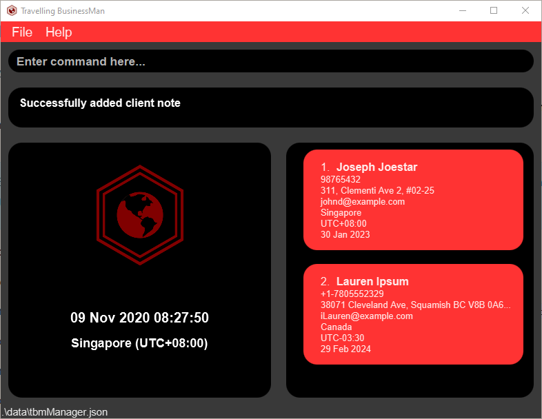

If you want to read off the note, you'll have to enter `client view 2`, which shall show you the client's details and notes in a scrollable display panel. Please note that when the display panel has more contents, a scrollbar shall appear for your use.


[Back to command](#211-adding-client-notes-client-note-add).

### Deleting client notes

Just like adding you may delete the client note from any window, but here, we show issue the command when we are already viewing a particular client. For example, in the following situation, you want to delete Alex's note that is labelled as index 2. Notice that Alex is client #1. 


Issue the following command: 

`client note delete 1 2` and you'll see that the 2nd note from client 1 will be deleted: 

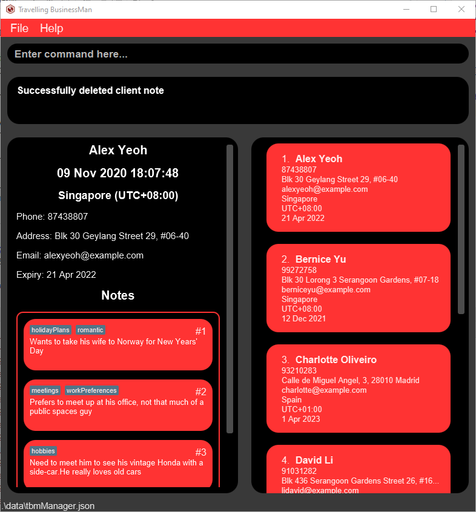

Note that the list immediately refreshes and indices of the other notes will be updated accordingly.

[Back to command](#212-deleting-client-notes-client-note-delete).

### Editing client notes

Let's say we want to change an existing note for Lauren because we realise that she prefers face to face meetings to emails, specifically italian restaurants. 
Here's how it looks like beforehand: 

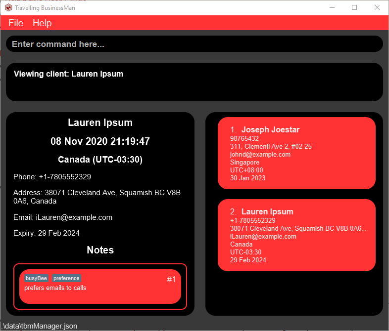

Note that the note has note index 1 and Lauren's client index is 2.

We can edit this information by issuing the command: `client note edit 2 1 nt/prefers face-to-face meetings to calls t/ItalianRestaurants`.
Immediately, the note card will update to reflect the newly edited note like so:

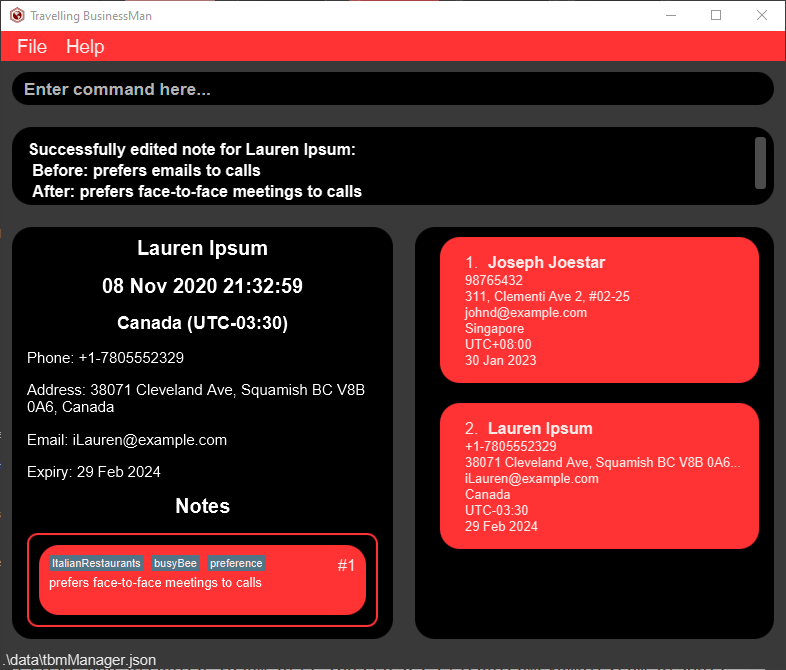

Please note that you could have edited only the tags or only the note contents if you so wished, instead of editing both the note contents and the tags.

[Back to command](#213-editing-client-notes-client-note-edit).

### Viewing country note

Below is a screenshot of what happens when you enter the command: `country note view c/SG` to view Singapore notes,


[Back to command](#221-viewing-notes-for-a-country-country-note-view).

### Adding country note

Before adding a note to Singapore, there is only one note for Singapore,


After adding the note, the display automatically updates,


[Back to command](#222-adding-notes-for-a-country-country-note-add).

### Editing country note

Before editing note 1 of Singapore, ensure that you first view the country notes of Singapore with `country note view c/SG`,


After editing, you will see the display update to show the new note,


[Back to command](#223-editing-notes-for-a-country-country-note-edit).

### Deleting country note

Initially, this is how the country notes panel will look like after issuing the command `country note view`.


After issuing the command `country note delete 1`, notice that the country note belonging to **Japan** with the content, **"A high-context country, hence building relationships is important for doing business"**, was deleted.


[Back to command](#224-deleting-notes-for-a-country-country-note-delete).

### Getting client suggestions

Initially this is how the client list panel will look like after issuing the command `client list`.


After issuing the command `client suggest by/contract`, notice that clients whose contract expiry date ends earlier would be displayed higher in the client list panel. 


[Back to command](#3-getting-suggested-clients).

### Clearing all data

This is how **_TBM_** looks like with existing data. 


After issuing the command `clear`, notice that all existing data will be cleared from **_TBM_**.


[Back to command](#4-clearing-all-your-entries).

<p align="center">
   <strong><i>{End of Appendix C, please return to the <a href="#table-of-contents">Table of Contents</a>}</i></strong> 
</p>


--------------------------------------------------------------------------------------------------------------------
